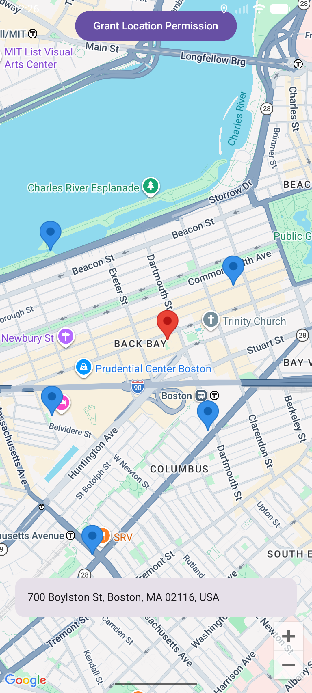

# Q2: Location Information & Mapping

## 1. Description
This application provides a real-time mapping interface that tracks user location, performs reverse geocoding, and allows for custom spatial data entry. Built using **Jetpack Compose** and the **Google Maps SDK for Android**.

### Key Features & Requirements
* **Requirement 1 (Permissions)**: Automatically requests `ACCESS_FINE_LOCATION` on app launch using `ActivityResultLauncher`.
* **Requirement 2 (Google Maps)**: Renders a dynamic Google Map that initializes at Boston University and automatically pans to the user's live coordinates upon acquisition.
* **Requirement 3 (Location Marker)**: Places a standard red marker at the user’s exact GPS coordinates with a snippet showing the location name.
* **Requirement 4 (Geocoding)**: Utilizes the `Android Geocoder` to translate latitude/longitude into a human-readable street address, displayed in a persistent Material3 Card.
* **Requirement 5 (Custom Markers)**: Allows users to tap anywhere on the map to drop custom **Azure-colored** markers to distinguish saved points from the live location.

---

## 2. Implementation Details
* **FusedLocationProviderClient**: Used for high-accuracy location tracking with optimized battery management (10s intervals).
* **Secrets Management**: The Google Maps API Key is protected using the `Secrets Gradle Plugin`. The key is stored in `local.properties` and injected at build time, ensuring it is never exposed in the version control history.
* **Lifecycle Awareness**: GPS updates are registered in `onResume` and unregistered in `onPause` to prevent unnecessary background battery drain.

---

## 3. Technical Specifications
* **Min SDK**: 26 (Android 8.0)
* **Target SDK**: 36
* **Location Services**: Google Play Services (Location & Maps)
* **UI Framework**: Jetpack Compose with Material3

---

## 4. Running the App
1. Create a `local.properties` file in the root directory.
2. Add your API Key: `MAPS_API_KEY=your_api_key_here`.
3. Ensure your emulator has **Google Play Services** installed and location is enabled.

### Screenshot

## 5. AI disclosure

Gemini assited in helping me obsure my API from this public github. In addition, it helped me verify I had met the requirements, format a few comments, and draft this README!
